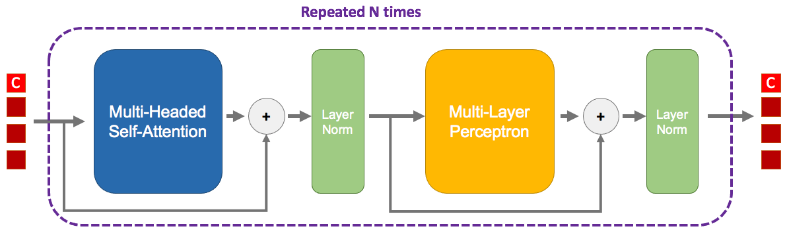
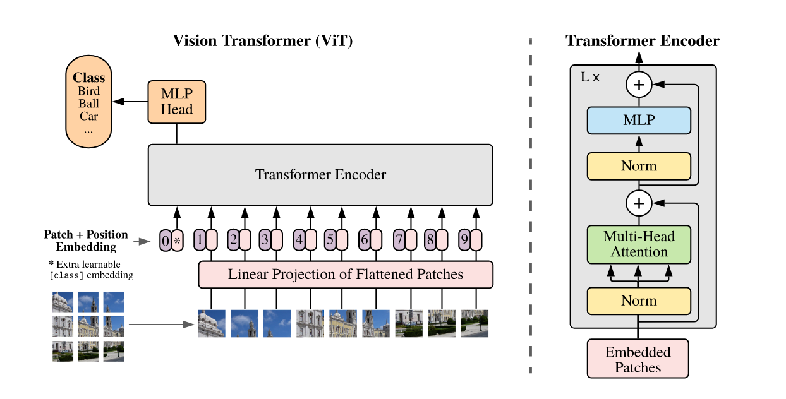
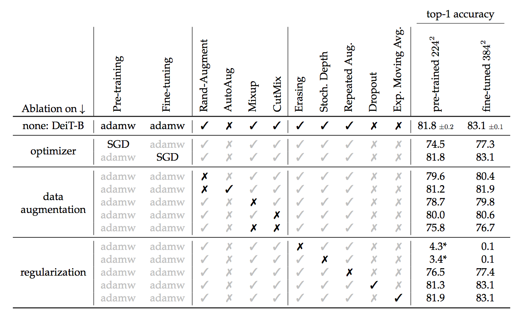
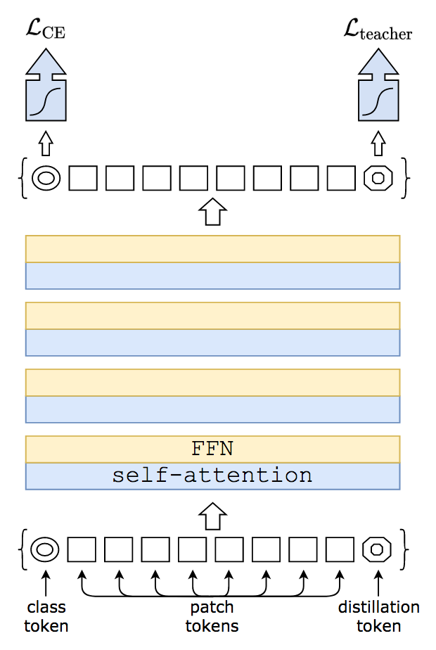
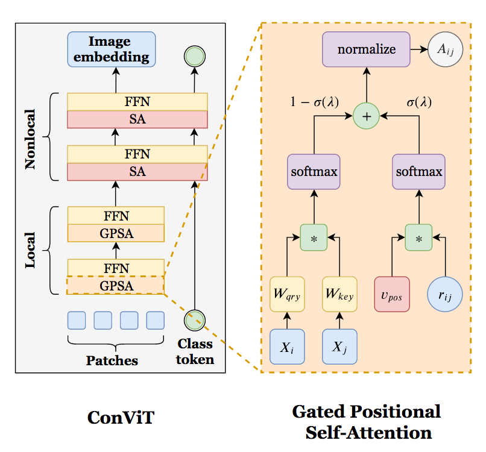
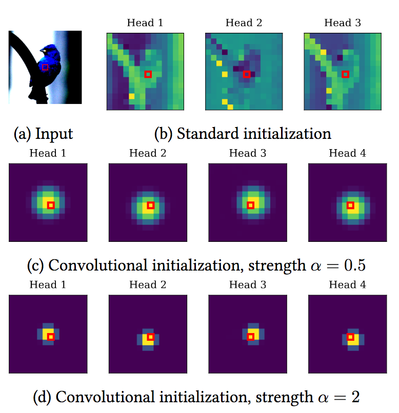
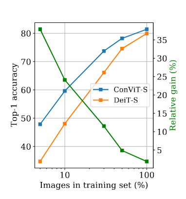
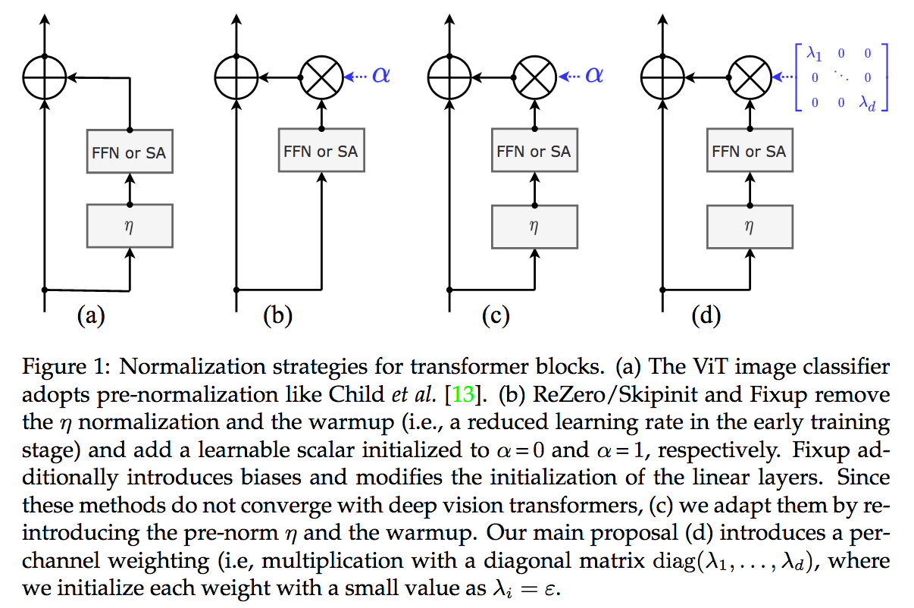
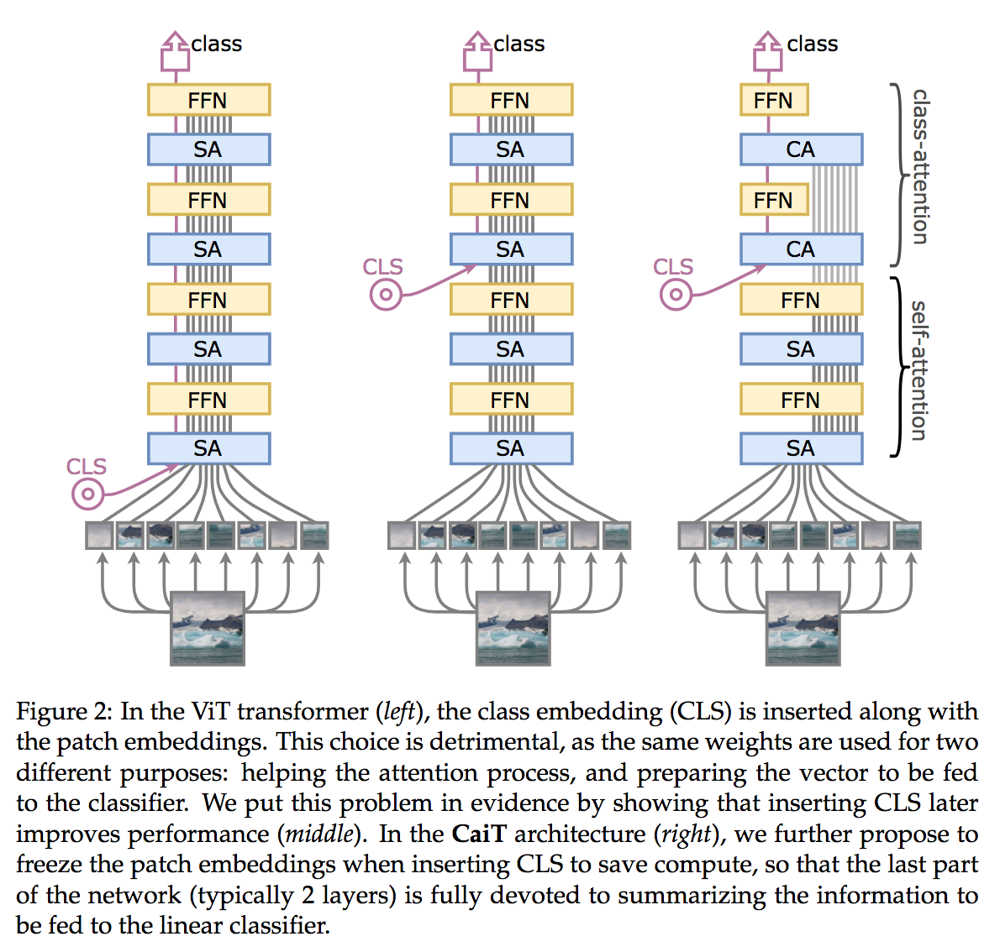

+++
title = "Visual Transformers"
blog = true

date = 2021-05-20
draft = false

hidden = true
authors = []

tags = []
summary = "Transformers have quasi-monopolized NLP research, what about Computer Vision?"

thumbnail = "202006181738.png"

[header]
image = ""
caption = ""

toc = true
+++

There are currently two broads axis of research in Deep Learning: finding better
architectures, or finding better losses to train them. Since AlexNet
([Kriwhevsky et al.](https://papers.nips.cc/paper/2012/file/c399862d3b9d6b76c8436e924a68c45b-Paper.pdf)),
Convolutional Neural Network is the main architecture used in Computer Vision.
Through convolutions, with its efficient patch prior, many visual tasks were unlocked.

Many variations of AlexNet were invented, but if we were to name only one, it would be
the ResNet ([He et al.](https://arxiv.org/abs/1512.03385)) and its residual shortcut.


The main drawback of convolutions is their lack of global reach. A problem, relatively similar
to the difficulty of Recurent Neural Networks (e.g. RNN, LSTM, GRU) to model long series of tokens.
The NLP community saw its "imagenet" moment when the Transformer ([Vaswani et al.](https://arxiv.org/abs/1706.03762))
architecture was unveiled. First designed with a somewhat complex encoder-decoder complex,
it was later refined in a serie of identical blocks in the BERT ([Devlin et al.](https://arxiv.org/abs/1810.04805))
model. Using transfer learning, most (all?) tasks of NLP were attacked via a BERT-like
architecture.

Two questions:
- What are exactly transformers?
- And can (should?) we apply them to Computer Vision?

# What are Transformers?

I can only recommend the excellent blog post of Jay Alammar "[The Illustrated Transformer](https://jalammar.github.io/illustrated-transformer/)"
which explain very well this architecture. But here is a quick recap, a transformer is basically that:



This whole **block** is repeated multiple times, the output of the first goes into the second and so on.
Contrary to CNNs or MLPs, the number of dimensions doesn't change across blocks.

You can also notice **residuals** twice. They are no different from the residuals in a ResNet, I guess that
a trick so good it is found everywhere.

## Tokens

The four red squares on the left are the **tokens**. There are only four on the image, but actually
you can use as much as you (and your RAM) want. A token is simply an piece of data that
was embedded. For example in NLP, you could have one token per word of your sentence. From
this word, we can use its **word2vec** correspondence giving a latent vector. To also indicate
where this word is located in the sentence, we add a positional encoding.

In this image, there is four tokens entering the block, and four tokens exiting the block. Therefore
at the end of the N blocks, we will still have four tokens, but only one of them will
be useful! The first token, here denoted by a 'C', is a special token called **class token**. It doesn't
belong to any word of the sentence, but is actually a vector that is learned during gradient descent.
Once this class token has gone through the N blocks, it will be finally given to
a classifier that will predict whatever you training for.

Put it simply, this class token will goes through the network and will extract as
much as possible useful information from the *word* tokens, in order to produce
a good representation for the classifier.

## Multi-Headed Self-Attention

This is the main part of the transformer. First, let's concentrate on the 'self-attention'.

We start with the matrix $X \in \mathbb{R}^{T \times d}$ containing all $T$ tokens. This matrix
is going to be linearly transformed (aka matrix multiplcation, aka go to a fully-connected layer)
three times in parallel:

$$Q = X W_q$$
$$K = X W_k$$
$$V = X W_v$$

They represent respectively the **Q**uery, the **K**ey, and the **V**alue.

We compute the attention $A \in \mathbb{R}^{T \times T}$:

$$A = \operatorname{softmax}(\frac{Q K^T}{\sqrt{d}})$$

As the name imply, this attention will determine how much a token correspond to another.
Notice that the shape of attention matrix $A$ is $T \times T$. For each row $i$, the value
of the column $j$ is the strength of the relationship between the word $i$ and word $j$.

We then multiply this attention matrix with the value matrix to *select* the data:

$$Z = A V$$

Where $Z \in \mathbb{R}^{T \times d}$ which has the original shape.

However, the attention matrix is quite restrictive: if the attention weight between
tokens $i$ and $j$ is large, then because of the softmax it will be low between
tokens $i$ and $u$. In order to model multiple kinds of attention, we use **multiple heads**.

Let's say we have two heads, then we do the previous self-attention but with different linear transformations:

$$Q_1 = X W\_{q_1}\,\, \text{and}\,\, Q_2 = X W\_{q_2}$$
$$K_1 = X W\_{k_1}\,\, \text{and}\,\, K_2 = X W\_{k_2}$$
$$V_1 = X W\_{v_1}\,\, \text{and}\,\, V_2 = X W\_{v_2}$$

$$Z_1 = \operatorname{softmax}(\frac{Q_1 K_1^T}{\sqrt{d}})\,\, \text{and}\,\, Z_2 = \operatorname{softmax}(\frac{Q_2 K_2^T}{\sqrt{d}})$$

But then, we have a matrix $Z' = \[Z_1 Z_2\] \in \mathbb{R}^{T \times 2d}$ that is
bigger than expected. We simply use again a linear transformation $W_o \in \mathbb{R}^{2d \times d}$:

$$Z = Z' W_o$$

Here is a simplified version in PyTorch:

```python
class SelfAttention(nn.Module):
    def __init__(self, dim, num_heads=8):
        super().__init__()
        self.Wq = nn.Linear(dim, num_heads * dim, bias=False)
        self.Wk = nn.Linear(dim, num_heads * dim, bias=False)
        self.Wv = nn.Linear(dim, num_heads * dim, bias=False)
        self.Wo = nn.Linear(num_heads * dim, dim)

    def forward(self, x):
        # X is of shape (Batch size, number of tokens, embedding dimension)
        B, T, D = x.shape

        q = self.Wq(x) # (Batch size, number of tokens, number of heads * embedding dimension)
        k = self.Wk(x)
        v = self.Wv(x)

        a = torch.softmax(torch.bmm(q, k.permute(1, 2)) / math.sqrt(D), dim=-1)
        z = torch.bmm(a, v)

        return self.Wo(z)  # (Batch size, number of tokens, embedding dimension)
```

*Note that in practice, to make the dimension of $Q$/$K$/$V$ independent to the number
of heads, we usually fix the maximum embedding size and split it equally between heads some space.*

## Layer Norm and MLP

The rest of the transformer is made of a MLP and two layers norms. The former
is simply several fully-connected layers with non-linear activations. The latter
are a form of [normalization layer](https://arthurdouillard.com/post/normalization/)
where the input is subtracted by its mean and divided by its standard deviation, and
then is linearly transformed by a set of weights and bias.

# ViT: Vision Transformer

Contrary to convolutions and recurrent networks, transformers don't really have a prior
of the input data. So we should easily apply it on images, right?

Some have incorporated part of the self-attention, as Axial-DeepLab ([Wang et al.](https://arxiv.org/abs/2003.07853)).
But none to the best of my knowledge, used the whole transformer architecture on images before
ViT ([Dosovitskiy et al.](https://arxiv.org/abs/2010.11929)).
Why? Well, in the case of images the number of tokens is huge. A $224 \times 224$ image
has $50,176$ pixels/tokens. This is too big to fit on a GPU.

The key idea, maybe inspired by BagNet ([Brendel et al.](https://arxiv.org/abs/1904.00760)),
is to consider a group of pixels as a patch. Instead of thousands of tokens, the image is
split into $14 \times 14 = 196$ tokens/patches, each made of $16 \times 16$ pixels.



The transformer architecture is exactly the same as one you could find in NLP. The
only difference is how to embed the tokens. In this case, it's simply a convolution applied
patch per patch (called 'linear projection' in the image). In addition of positional encoding
based on the position of the patch in the image is used.

The performances of ViT are very impressive. But a major drawback is that this architecture
has almost no prior for images. Therefore, while it can potentially reach better results given
infinitely large amount of data, it is very hard to train it with few images. The authors of ViT,
all from Google, use JFT-300M a large private dataset to pretrain their model on it before
transferring the knowledge to ImageNet-{21/1k}.

# DeiT: A more efficient training of Vision Transformer

DeiT ([Touvron et al.](https://arxiv.org/abs/2012.12877)) is an extention of ViT with two
main contributions: a more efficient training and a transformer-based knowledge distillation.

Through tons of regularization, the authors manage to train a DeiT from scratch on ImageNet with
good performance. Two crucial regularizations are random erasing of the image pixels,
and stochastic depth ([Huang et al.](https://arxiv.org/abs/1603.09382)). The latter is
a kind of dropout, but where a whole transformer block is dropped with only the residual used.



The second contribution of DeiT is to propose to improve the training of the transformer
by using a teacher model. The teacher/student strategy is often seen where a large trained
teacher model produces novel targets to the student through knowledge distillation
([Hinton et al.](https://arxiv.org/abs/1503.02531)). Basically, the student is train
to predict the labels of the image but also to mimick the probabilities of the teacher.

The first interesting conclusion is that it's better to use a large CNN
(a RegNet ([Radosavovic et al.](https://arxiv.org/abs/2003.13678))) as a teacher than
a large vision transformer. Intuitively, we may hypothesize that is because a convolution-based
teacher has learned different knowledge and thus may diversify better the predictions of the student.

The second conclusion is that using the output of the student classifier is not the best way
to do knowledge distillation. Recall that the transformer's classifier input is the class token that
has gone through all blocks. DeiT instead add a new token, called a **distillation token**,
and with it a new classifier. This classifier will be solely devoted to the task of distillation
with the teacher, while the original classifier with class token will resume the image classification task.



# ConViT: Make Prior Great Again

ViT needs a 300M dataset to train. DeiT *only* needs a 1.2M dataset (ImageNet) to train.
But can't we learn with a few thousand of images like a good old resNet can?

You need a prior to learn with few data point.

This is the message of ConViT ([D'Ascoli et al.](https://arxiv.org/abs/2103.10697)). They
modify the usual Self-Attention (SA) into a **Gated Positional Self-Attention** (GPSA):



As shown on the diagram, only the attention part is modified, while the multiplication
with the value matrix is left unchanged. This attention is now a linear combination
between the self-attention and a positional prior. A **learned gate** (aka a learned vector followed
by a sigmoid) balances between both branch, although its initialization enforces at first
a strong emphasis on the positional prior. This positional prior, initialized the
right way, can mimick a convolutional kernel.

A locality strength factor $\alpha$ can modulate how big this kernel should be:




The authors find that at the training end, the early transformer blocks (2 - 7)
mainly use the positional prior, while the first and final blocks (8 - 10) use
the global reach of the self-attention.

With few data, the positional prior has an important role as the following graph shows:



## CaiT: Further Refinements of DeiT

The authors from DeiT later released CaiT ([Touvron et al.](https://arxiv.org/abs/2103.17239)),
a refinement of of DeiT.

The first contribution is LayerScale, a ponderation scheme for the main branch in
the residual architecture. As for ResNet, each block has two branches: an identity
branch that often does nothing, and the branch with learnable parameters. In the case of
transformers, those parameters are either the MLP or the Multi-headed Self-Attention.

Previous works (ReZero [Bachlenchner et al.](https://arxiv.org/abs/2003.04887),
SkipInit [De et al.](https://arxiv.org/abs/2002.10444), and FixUp [Zhang et al.](https://arxiv.org/abs/1901.09321))
wondered if we could train a ResNet without batch normalization. They all found, with minor
variations, that it was possible if main branch of a ResNet block was weighted by
a learned scalar $\in \mathbb{R}$. LayerScale proposes more or less the same, but
with one scale per dimension $\in \mathbb{R}^D$, initialized to a small $\epsilon$ value:



The second contribution of CaiT, is very similar to a contribution of ConViT (authors
are partially the same): CaiT also introduces the class token after several blocks.
The last few blocks with class tokens implement a **Class Attention**.

Contrary to **Self-Attention**, this Class Attention *freeze* the patch tokens:



Put it more simply, the patch tokens aren't updated anymore after each block of Class Attention.
Moreover, the attention is not done between all patches tokens $X_p \in \mathbb{R}^{(T-1) \times D}$ anymore (at a quadratic cost $T^2$),
but only with the class token $X_c \in \mathbb{R}^{1 \times D}$ (at a linear cost $T$):

$$Q = X_c W_q$$

$$K = \[X_c\, X_p\] W_k$$

$$V = \[X_c X_p\] W_v$$

The computational speed up is easily seen as the attention product is not anymore quadratic
w.r.t the number of patches. Furthermore, it gives a nice performance gain, as the Self-Attention
layers are now allowed to focus on extracting class-agnostic features.


# The Future of Vision Transformers

ViT first proves that it was possible to train transformers on visual tasks. DeiT then showed
that with carefully designed regularizations, the training could be done on relatively
small scale datasets. This contribution, and the fantastic [Timm library](https://github.com/rwightman/pytorch-image-models),
opened a gold rush on transformers.

I won't enumerate all variants here. Some may be only a sligth tweak and will be forgotten,
others may prove to be a stepping stone in the transformers world. Only time will tell.

But, that's assuming that transformers is indeed the right solution. Attention is all we need?
Recent research on MLPs (yes, you read correctly) indicates that maybe attention is
only a special case of a more general framework. I'll cover it in a later post!
